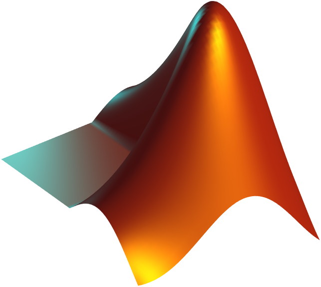
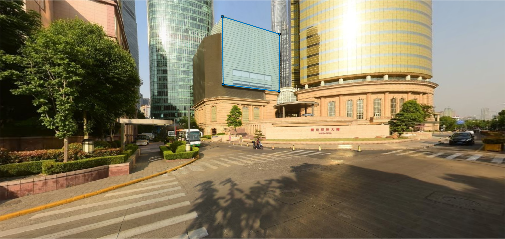
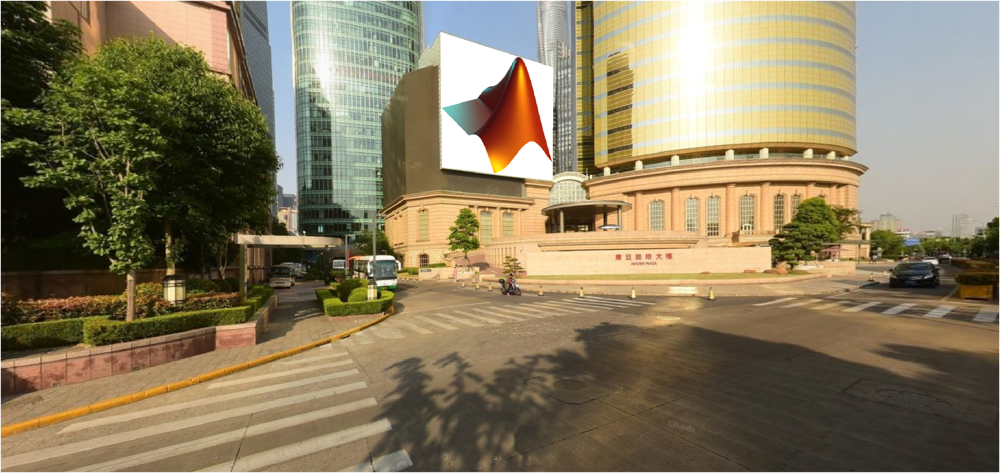

# perspective homography matlab

This is a matlab program to project an image in perspective view of a background image. **Only 10 lines of code will do!**

## Example

```matlab
% perspective-homography-matlab 即广告牌贴图
bigImg = imread("bigImg.png");
figure;imshow(bigImg);
```


```matlab
logoImg = imread("logo.png");
figure;imshow(logoImg);
```



```matlab
figure(1)
roi = drawpolygon();% Order of point taking: topleft,topright,bottomright,bottomleft
```



```matlab
fixedPts = roi.Position;
movIngPts = [[1,1]; % topleft
    size(logoImg,2),1; % topright
    size(logoImg,2),size(logoImg,1);% bottomright
    1,size(logoImg,1)];% bottomleft
tform = fitgeotform2d(movIngPts,fixedPts,"projective");% homography tfansformation

% warp image,specify output view range
ref = imref2d(size(bigImg,[1,2]),[1,size(bigImg,2)],[1,size(bigImg,1)]);
alignedImg = imwarp(logoImg,tform,OutputView=ref);

% 贴图
blender = vision.AlphaBlender("Operation","Binary Mask","MaskSource","Input port");
outImg = blender(im2single(bigImg),im2single(alignedImg),sum(alignedImg,3)~=0);
figure;imshow(outImg)
```


