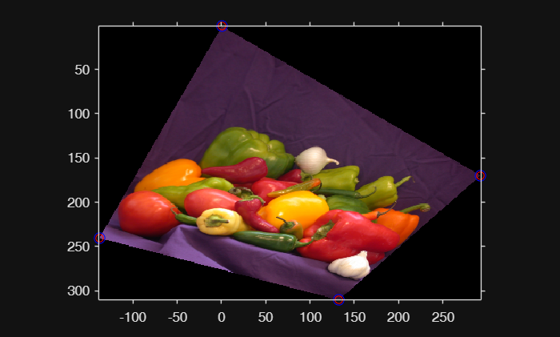

# 透视变换原理（Perspective Transformation）

 本文从**相机成像几何**出发，一步步推导 **8自由度单应矩阵**，最终给出 **DLT 线性求解公式**，让你迅速彻底掌握透视变换/单应变换矩阵估计的数学本质。

---

## 1. 成像点变换

世界坐标 $(X,Y,Z)$ → 相机坐标 → 图像坐标 $(x,y)$

用 **3×3 内参矩阵** + **齐次坐标** 表示：

$$ \left\lbrack \begin{array}{c} X\newline Y\newline Z \end{array}\right\rbrack =\left\lbrack \begin{array}{ccc} h_{11}  & h_{12}  & h_{13} \newline h_{21}  & h_{22}  & h_{23} \newline h_{31}  & h_{32}  & h_{33}  \end{array}\right\rbrack \left\lbrack \begin{array}{c} x\newline y\newline 1 \end{array}\right\rbrack \quad (1)$$

**关键**：$h_{33} ≠ 0$，除以第 3 行后得到真实像素坐标。

## 2. 平面到平面：透视变换矩阵 H（8自由度）

当所有点都躺在 **同一个平面**（Z = 常数，例如 Z=0）时，**消去 Z**：

$$
A =
\begin{bmatrix}
h_{11} & h_{12} & h_{13} \\
h_{21} & h_{22} & h_{23} \\
h_{31} & h_{32} & h_{33}
\end{bmatrix}
\quad (2)
$$

**H 与 kH 表示完全相同变换**（齐次性）。

## 3. 目标：已知 4 对点，求 H

设源点 $(x_1, y_1)$ → 目标点 $(x_2, y_2)$，展开写成（消去尺度）：

$$
\begin{bmatrix}
x_1 & y_1 & 1 & 0 & 0 & 0 & -x_1 x_2 & -y_1 x_2 & -x_2 \\
0 & 0 & 0 & x_1 & y_1 & 1 & -x_1 y_2 & -y_1 y_2 & -y_2
\end{bmatrix}
\begin{bmatrix}
h_{11}\\h_{12}\\ \vdots \\h_{33}
\end{bmatrix}
= \mathbf{0}
\quad (3)
$$

每对点贡献 **2 行**，4 对点 → **8 行**，刚好解 8 个自由度。

## 4. DLT 线性求解（Direct Linear Transformation）

堆叠 4 对点得到 **A h = 0**（8×9 矩阵）：

$$
\underbrace{
\begin{bmatrix}
x_1 & y_1 & 1 & 0 & 0 & 0 & -x_1 x_2 & -y_1 x_2 & -x_2 \\
0   & 0   & 0 & x_1 & y_1 & 1 & -x_1 y_2 & -y_1 y_2 & -y_2 \\
\vdots & \vdots & \vdots & \vdots & \vdots & \vdots & \vdots & \vdots & \vdots \\
x_1' & y_1' & 1 & 0 & 0 & 0 & -x_1' x_2' & -y_1' x_2' & -x_2' \\
0   & 0   & 0 & x_1' & y_1' & 1 & -x_1' y_2' & -y_1' y_2' & -y_2' \\
\end{bmatrix}
}_{A\ (8\times9)}
\underbrace{
\begin{bmatrix}
h_{11}\\h_{12}\\\vdots\\h_{33}
\end{bmatrix}
}_{h\ (9\times1)}
= \mathbf{0}
\quad (4)
$$

**解法**：对 A 做 SVD：

$$
A = U \Sigma V^T \quad \Rightarrow \quad
h = V_{(:,9)} \quad \text{(最后一列)}
$$

最后归一化 $h_{33} = 1$：

$$
H = \text{reshape}(h, [3,3]) / h_{33}
$$

超定（>4 对点）时，SVD 自动给出**最小二乘最优解**。

---

## 5.  Implementation in MATLAB

准备测试图像和单应矩阵：

```matlab
img = imread("peppers.png");
imshow(img)
```


```matlab
theta = 30;
A = [cosd(theta) -sind(theta) 0; ...
     sind(theta)  cosd(theta) 0; ...
     0.001        0.001       1];
tform = projtform2d(A);
[outimg,outR] = imwarp(img,tform);
imshow(outimg,outR)


% 找到4个角点对应的坐标并绘图预览
[srcX,srcY] = meshgrid([1,size(img,2)],[1,size(img,1)]);
[dstX,dstY] = transformPointsForward(tform,srcX(:),srcY(:));
hold on;
scatter(dstX,dstY,32,"red")
```


### test

构建Ax =0,svd求解H：

```matlab
fixedPts = [srcX(:),srcY(:)];
movingPts = [dstY(:),dstY(:)];
H = fitHomography(fixedPts,movingPts);

% 验证H的正确性
tform2 = projtform2d(H);
[dstX2,dstY2] = transformPointsForward(tform,srcX(:),srcY(:));
hold on;
scatter(dstX2,dstY2,64,"blue")
```



## References

<https://blog.csdn.net/cuixing001/article/details/80261189>

<https://github.com/cuixing158/SVD-Fit-Line>


